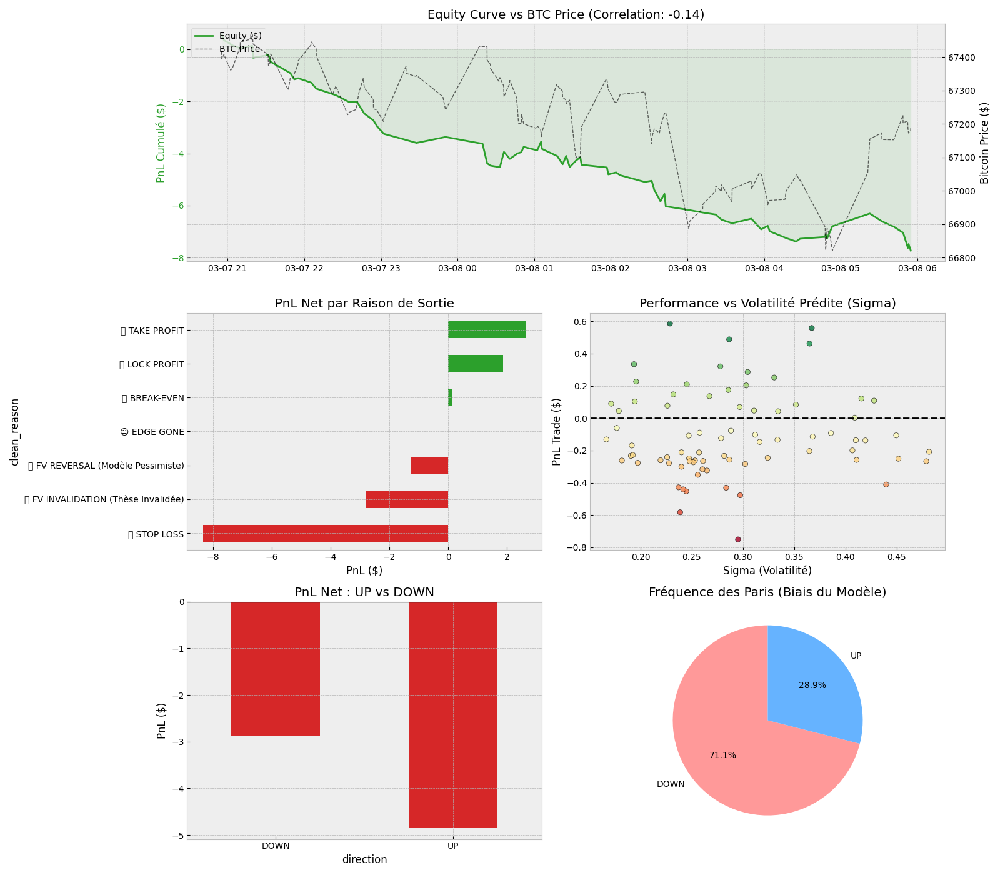

# Polymarket-Misspricing-Bot

Exploits mispricing of Polymarket's BTC 15-minute Up/Down binary options: models the
underlying's implied volatility with a gradient-boosted tree, prices the binary with
Black-Scholes, and compares the model's fair value against Polymarket's live order
book. Paper-trading only — no wallets, private keys, or order placement.

## Method

- **Pricing**: `pricing.py` — `BS_Bin` returns the fair Up/Down probability as the
  discounted risk-neutral `N(d2)` / `1 - N(d2)` of a binary option.
- **Implied volatility model**: an XGBoost/LightGBM regressor (`LGBM_ShortVol/`)
  trained on Deribit option data merged with Binance spot features (rolling
  volatility, momentum, RSI), predicting short-horizon IV rather than reading it
  directly off Deribit's quoted smile.
- **Feature contract**: the live feature vector (`feature_engine.py`) must match, in
  exact column order, the vector the model was trained on
  (`LGBM_ShortVol/data/data_creator.py`) — a mismatch silently produces garbage
  predictions, so the two are versioned together.

## Architecture

A single asyncio process built around one central queue:

- **Producers**: Binance 1m klines (rolling features), an hourly Deribit REST call
  (risk-free rate from futures basis), a Deribit option-book snapshot (liveness gate),
  and two Polymarket feeds (spot price, CLOB order book for the active 15-minute
  market).
- **Consumer**: builds the live feature vector, predicts volatility, prices the
  binary, and runs entry/exit logic — maker/post-only entries sized with fractional
  Kelly, and a priority ladder of exits (take-profit, fair-value invalidation,
  trailing stop, edge compression, break-even, hard stop).
- Every closed trade is logged to `trade_logs/trade_journal.csv`.

## Results



Over one logged paper-trading session (76 trades, 2026-03-07 20:55 UTC to
2026-03-08 05:54 UTC), the strategy closed net PnL of **-$7.73** at a **32.9%**
win rate (25 wins / 51 losses). The model's calls were heavily skewed toward DOWN
(54 DOWN vs. 22 UP, a 71.1%/28.9% split), and DOWN trades held up better than UP
trades (DOWN: -$2.88 total PnL, 38.9% win rate; UP: -$4.84 total PnL, 18.2% win
rate). The largest single exit-reason bucket was `STOP LOSS HARD` (29 of 76
trades), followed by `FV INVALIDATION` (16) and `LOCK PROFIT` (13).

## Approaches explored

- **Neural-network IV model** (`bot_poly_taker_v3/`) — same live architecture, but the
  IV model is a PyTorch MLP over 24h/4h macro features instead of the XGBoost/1h-15m
  feature set, requiring a fitted `StandardScaler`.
- **Foundation-model signal** — a variant using
  [Kronos](https://github.com/shiyu-coder/Kronos), a pretrained time-series
  foundation model, to forecast the underlying directly instead of an
  XGBoost-modeled IV.
- **Standalone market-making variant** — an inventory-aware (Avellaneda-Stoikov
  style) maker quoting both sides of the Up/Down book instead of taking mispriced
  one-sided edges.

## How to run

```bash
python main.py   # paper-trading only; needs internet for Deribit/Binance/Polymarket WebSockets
```

## Limitations & next steps

- No real order placement or settlement — entirely simulated.
- Absolute paths and tuning constants (edge thresholds, Kelly fraction, cooldowns)
  are inline literals rather than a config file.
- `GP_Vol/` (a Gaussian-Process volatility approach) is an unimplemented placeholder.
